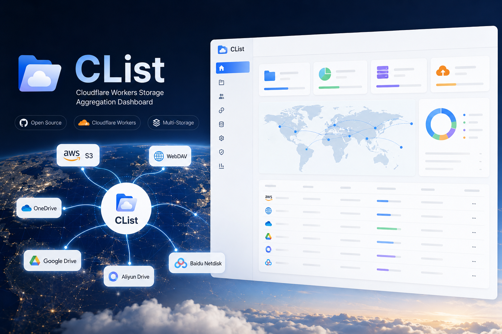
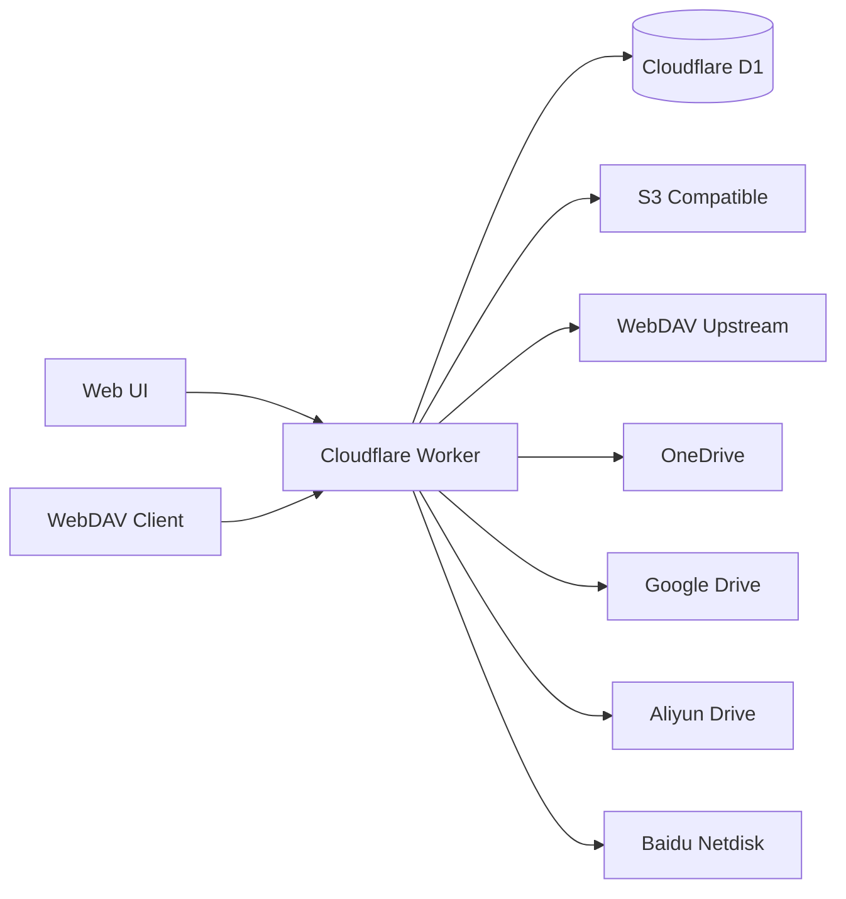

# CList

<p align="center">
  <strong>基于 Cloudflare 的原生云存储聚合面板：WebDAV、多存储后端、文件预览、分享、审计日志与管理员控制。</strong>
</p>

<p align="center">
  <a href="./README_zh-CN.md">简体中文</a>
  ·
  <a href="./docs/deployment.md">部署文档</a>
  ·
  <a href="./docs/webdav.md">WebDAV 文档</a>
  ·
  <a href="./GITHUB_WORKFLOW_DEPLOY.md">GitHub Actions 部署</a>
</p>

<p align="center">
  <a href="https://github.com/Waitner125/Cloudflare-Clist/stargazers">
    
  </a>
  <a href="https://github.com/Waitner125/Cloudflare-Clist/network/members">
    
  </a>
  <a href="https://github.com/Waitner125/Cloudflare-Clist/blob/master/LICENSE">
    
  </a>
  <a href="https://workers.cloudflare.com/">
    
  </a>
  <a href="https://www.typescriptlang.org/">
    
  </a>
</p>

<p align="center">
  
</p>

## 项目概述

CList 将 Cloudflare Workers + D1 转化为轻量级云存储聚合服务，通过统一的 Web 界面与 WebDAV 端点访问 S3 兼容存储、WebDAV 服务器、OneDrive、Google Drive、阿里云盘与百度网盘。

它面向小型个人数据中心、公共下载镜像、私有文件枢纽与边缘托管存储面板等场景——无需部署传统服务器即可获得完整的存储管理能力。



## 核心特性

- 多存储文件浏览器，支持公开 / 私有权限控制
- WebDAV 服务端点，支持桌面同步工具、移动文件管理器与 CLI 客户端
- S3 兼容存储支持（自定义端点与基础路径）
- OneDrive、Google Drive、阿里云盘、百度网盘等网盘集成
- 文件上传、下载、新建文件夹、重命名、移动、复制、删除等完整操作
- 文本、Markdown、代码、图片、音频、视频与文档的在线预览
- 基于令牌的公开分享链接
- 存储统计与可视化图表（总大小、文件数、文件夹数、文件类型分布）
- 管理操作与文件操作审计日志
- Cloudflare D1 持久化与 Workers 边缘部署
- GitHub Actions 可重复部署指南

## 支持的存储后端

| 后端 | 浏览 | 上传 | 重命名 / 移动 | 说明 |
| --- | --- | --- | --- | --- |
| S3 兼容 | 是 | 是 | 是 | 支持 R2 及各类 S3 兼容端点 |
| WebDAV 上游 | 是 | 是 | 是 | 同时通过 CList 自身 WebDAV 服务暴露 |
| OneDrive | 是 | 是 | 是 | 支持在线刷新 API 或自定义 OAuth 应用 |
| Google Drive | 是 | 是 | 是 | 支持在线刷新 API 或自定义 OAuth 应用 |
| 阿里云盘 | 是 | 是 | 是 | 使用阿里云开放 API 风格令牌刷新 |
| 百度网盘 | 是 | 是 | 是 | 基于 refresh token 访问 |

## 快速开始

### 1. 克隆并安装依赖

```bash
git clone https://github.com/Waitner125/Cloudflare-Clist.git
cd Cloudflare-Clist
npm install
```

### 2. 创建 D1 数据库

```bash
npx wrangler login
npx wrangler d1 create clist
```

记下返回的 `database_id`，下一步会用到。

### 3. 配置 Wrangler

从示例配置创建生产配置：

```bash
cp wrangler.jsonc.example wrangler.jsonc
```

将 Wrangler 返回的 `database_id` 填入 `wrangler.jsonc`：

```jsonc
{
  "$schema": "node_modules/wrangler/config-schema.json",
  "name": "clist",
  "main": "./workers/app.ts",
  "compatibility_date": "2025-04-04",
  "keep_vars": true,
  "d1_databases": [
    {
      "binding": "DB",
      "database_name": "clist",
      "database_id": "your-d1-database-id",
      "migrations_dir": "./migrations"
    }
  ]
}
```

> 推荐：管理员密码等敏感信息请使用 Cloudflare Dashboard 的 **Variables & Secrets** 管理。保持 `keep_vars: true` 可避免部署时覆盖 Dashboard 中已配置的变量。

### 4. 应用数据库迁移

```bash
npx wrangler d1 migrations apply clist --remote
```

### 5. 部署

```bash
npm run build
npx wrangler deploy
```

## 环境变量

| 变量 | 必填 | 示例 | 说明 |
| --- | --- | --- | --- |
| `DB` | 是 | D1 binding | Cloudflare D1 数据库绑定 |
| `ADMIN_USERNAME` | 是 | `admin` | 管理员登录用户名 |
| `ADMIN_PASSWORD` | 是 | `change-me` | 管理员登录密码 |
| `SITE_TITLE` | 否 | `CList` | 界面显示的站点标题 |
| `SITE_ANNOUNCEMENT` | 否 | `欢迎使用` | 面向访客显示的公告文本 |
| `CHUNK_SIZE_MB` | 否 | `10` | 浏览器上传分块大小 |

> **WebDAV 不再使用环境变量配置**。启用状态、用户名与密码均在项目的「设置 → WebDAV 服务」页面中配置，并加密存储于 D1 数据库。

## WebDAV

WebDAV 服务在设置页面中启用并配置（无需环境变量）：

1. 登录管理员账号 → 打开「设置」
2. 在「WebDAV 服务」选项中打开启用开关
3. 设置 WebDAV 用户名与密码，点击保存

启用后通过以下地址访问：

```text
https://your-domain.example/dav/0/            # 所有存储
https://your-domain.example/dav/{storageId}/  # 指定存储
```

注意事项：

- WebDAV 地址需要以斜杠 `/` 结尾。
- 使用 HTTP Basic Auth，凭据为设置页面中配置的用户名 / 密码。
- 桌面端 Windows WebDAV、macOS Finder、Cyberduck、RaiDrive、NetDrive 及多数移动文件管理器可直接连接。
- CList 支持 `OPTIONS`、`PROPFIND`、`GET`、`HEAD`、`PUT`、`DELETE`、`MKCOL`、`COPY`、`MOVE` 方法。

更多细节：[docs/webdav.md](./docs/webdav.md)

## 网盘配置说明

CList 遵循 OpenList 风格的驱动流程进行云盘令牌刷新：

- OneDrive、Google Drive、阿里云盘、百度网盘默认启用在线刷新 API。
- 兼容既有 OpenList 风格的 `api_url_address` 字段，同时支持 CList 的 `api_address`。
- 未配置本地 `client_id` / `client_secret` 时，自动回退到在线刷新 API。
- 刷新后的令牌持久化到存储状态，重复浏览无需重新登录。

## 开发

```bash
npm run dev
```

常用检查：

```bash
npm run build
npm run typecheck
npx wrangler deploy --dry-run
```

## 项目结构

```text
app/
  components/        React 组件
  lib/               存储客户端、认证、审计、工具
  routes/            React Router 路由与 API 端点
workers/
  app.ts             Cloudflare Worker 入口
migrations/          D1 迁移脚本
docs/                部署与 WebDAV 文档
public/              静态资源
```

## 文档

- [部署指南](./docs/deployment.md)
- [配置指南](./docs/configuration.md)
- [WebDAV 指南](./docs/webdav.md)
- [GitHub Actions 部署](./GITHUB_WORKFLOW_DEPLOY.md)

## Star History

<a href="https://www.star-history.com/#Waitner125/Cloudflare-Clist&Date">
  <picture>
    <source media="(prefers-color-scheme: dark)" srcset="https://api.star-history.com/svg?repos=Waitner125/Cloudflare-Clist&type=Date&theme=dark" />
    <source media="(prefers-color-scheme: light)" srcset="https://api.star-history.com/svg?repos=Waitner125/Cloudflare-Clist&type=Date" />
    
  </picture>
</a>

## 支持

- GitHub Issues: [Waitner125/Cloudflare-Clist/issues](https://github.com/Waitner125/Cloudflare-Clist/issues)
- 作者: [@ooyyh](https://github.com/ooyyh)
- 邮箱: laowan345@gmail.com

## 许可证

CList 基于 [MIT License](./LICENSE) 发布。
